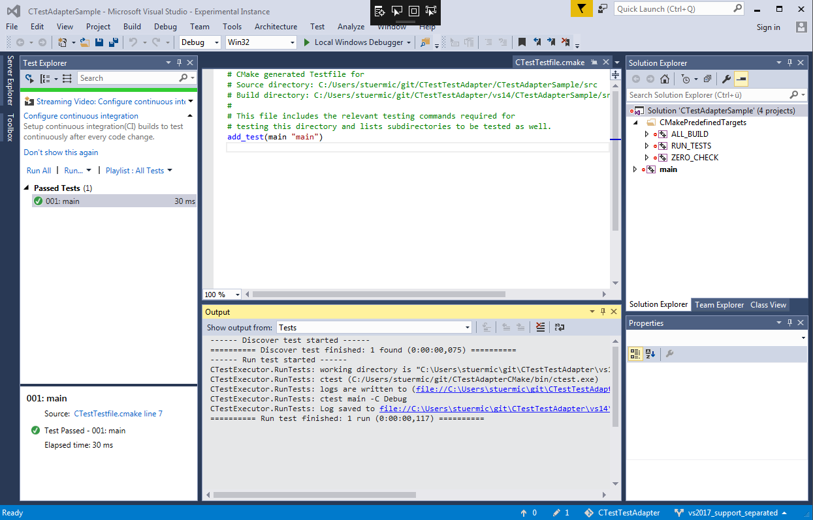

# CTestAdapter

This Visual Studio extension provides a test adapter to run [kitware's CMake/CTest](http://cmake.org/) from the Visual Studio (2012/2013/2015/2017) Test Explorer.

## Credits

CTestAdapter is based on [CTestTestAdapter](https://github.com/toeb/CTestTestAdapter) from Tobias Becker.

## Features

* Discovers all tests which are added to your software using `add_test()` in your CMake scripts. 
* Discovers the correct CMake and CTest binary from the `CMakeCache.txt` in your solution directory.
* Control of test execution through Test Explorer Window
* Success or Fail based on Outcome of ctest run
* Shows console output of test if test fails
* Shows source line where test is executed in `CTestTestfile.cmake`
* Allows debugging of tests
  * You need the **[Microsoft Child Process Debugging Power Tool](https://marketplace.visualstudio.com/items?itemName=GreggMiskelly.MicrosoftChildProcessDebuggingPowerTool)** from Gregg Miskelly for attaching to the child processes which are spawned by ctest

  

----

## Building

Building and Testing/Debugging CTestAdapter is very easy using the prepared generation scripts.

### Requirements

* Visual Studio 2012/2013/2015/2017 (depending on the version for which you want to build the extension)
* CMake 3.8.0 or later (for C# support)

### Build the software

* Depending on the Visual Studio version you want to target run one of the batch scripts:
  * [SetupVs2012.bat](SetupVs2012.bat)
  * [SetupVs2013.bat](SetupVs2013.bat)
  * [SetupVs2015.bat](SetupVs2015.bat)
  * [SetupVs2017.bat](SetupVs2017.bat)

* There will be binary directories generated where you can find the CTestAdapter.sln solution
  * vs11 (for Visual Studio 2012)
  * vs12 (for Visual Studio 2013)
  * vs14 (for Visual Studio 2015)
  * vs15 (for Visual Studio 2017)

* Build the software
* after building, the generated `.vsix` extension will be placed in the binary directory
  * **CTestAdapter-Debug.vsix** (for debug mode)
  * **CTestAdapter-Release.vsix** (for release mode)
  
### Debug the software

In the generated solution, the startup project is already set to CTestAdapter, along with all necessary paramters to debug the extension straight away. Just start *CTestAdapter* in the debgger and verify the tests from the sample project are shown and can be executed.

### Troubleshooting debugging

In some situations it can happen, that the built extension cannot be deployed to the experimental hive of Visual Studio. If this happens, the complete experimental configuration can be deleted to ensure a clean environment when starting the debugger.

* Run [ClearExperimentalHive.bat](ClearExperimentalHive.bat) to clear all experimental configurations of all Visual Studio versions

## Issues

* Support for Visual Studio 2017 does not work until now. Test containers are discovered but the test discoverer does not seem to be instantiated at all
* re-configuring the solution with cmake can lead to crashes of Visual Studio, probably because of concurrent access to `CTestTest.cmake` files

----

*note*:  The CMake logo belongs to kitware and is under the Creative Commons license.
